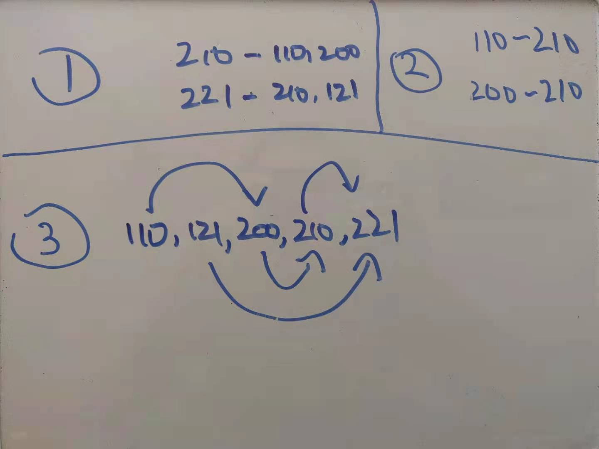

# Prerequisite-Checker 

This is a prolog course project for UBC CPSC 312

# What is the problem?

Given a knowledge base containing university courses that have information on:

- the term and year in which a course is offered
- which courses should be taken before which other courses

This prolog program will take:

- a list of courses you want to take

and return an **ordering of courses** such that prerequisites for any given course X are completed before one is scheduled to take course X.

For example, a list of courses can be denoted in the knowledge base as follows:

```
% cpsc100 is scheduled in winter 2020, is worth 3 credits and has no prerequsites 
course(cpsc100,2020,winter,3,[req(pre,none)]). 
 % cpsc 110 is schduled in winter 2020, is worth 3 credits and has no prerequisites
course(cpsc110, 2020, winter, 3, [req(pre, none)]).
% cpsc200 is scheduled in summer 2021, is worth 3 credts and has 2 pre-requsities i.e., cpsc100 and cpsc110
course(cpsc200,2021,sum,3,[req(pre,cpsc100),req(pre,cpsc110)]). 
```

The ```updateSchedule``` query will return the schedule that you should take a given list of courses in

```
updateschedule([],[cpsc100, cpsc200, cpsc110],NewSchedule)
```

The schedule can be printed to the screen by calling:

```
printlist(NewSchedule)
```

We can also make sure this schedule does not exceed a given number of credts per term by querying ```canBeCompleted```:

```
canBeCompleted(NewSchedule,9). % returns true if we can complete NewSchedule without exceeding 9 credits per term
```
# What is the something extra?

Our program will use Kahn's topological sorting algorithm (implemented in prolog) to calculate the order courses should be taken in.

This will be done in 3 steps as illustrated in the image below:



Step 1: Create a data structure to represent courses and their prerequisites 

Step 2: Turn this data structure representation into graph edges where the edge ```a -> b``` means ```a``` is a prerequisite of ```b```.

Step 3: Use Kahn's topological sorting algorithm to sort the graph such that prerequisites always appear before the courses that need them.

Our program will also consider things like handling

- Alternate prerequisites (MATH xxx or CPSC yyy is a prerequisite to CPSC zzz)
- Co-requisites (CPSC xxx can be taken before or at the same time as CPSC yyy)

In addition, we will also provide a prolog query to determine whether a given ordering of courses can be completed without exceeding a maximum number of credits per term.

# Demo

Starting with the "what is the problem part."

Before the demo introduce:

- The structure of the course.
  
- The structure of the requirements.

Demo test cases:

- case1: course with no requirements.
- case2: course with prerequisite.
- case3: course with corequisite.
- case4: course with alternative prerequisites.
- case5: courses with multiple types of requirements.
- case5: fail cases.

Ask the TA about cases he want us to test.

Explain the code:

- The updateschedule function.
- The toposort fucntion.
- The fit function.

End with the "Whats something extra" part.

Let the TA ask questions.
  
